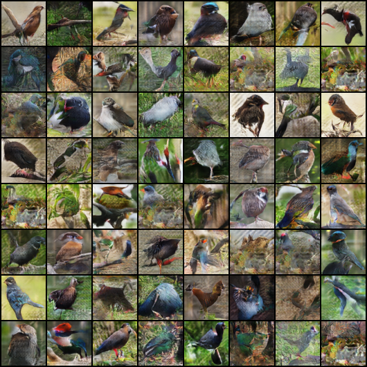

# DCGAN implementation in PyTorch Lightning

I used the `BIRDS 400 - SPECIES IMAGE CLASSIFICATION` dataset from [Kaggle](https://www.kaggle.com/datasets/gpiosenka/100-bird-species) to train my DCGAN.

Here is the result after 500 epochs of training:

